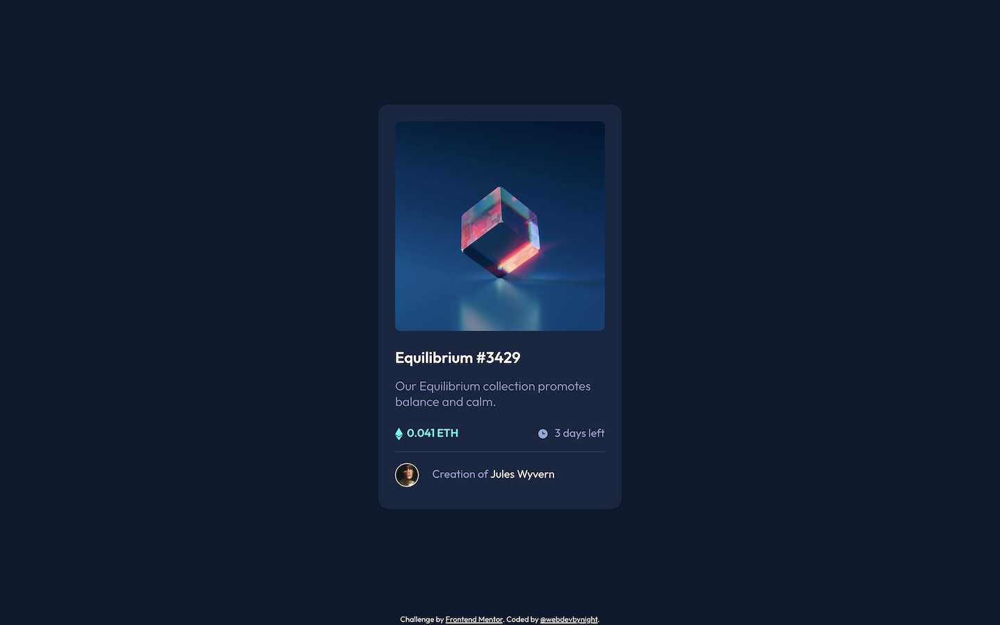

# Frontend Mentor - NFT preview card component solution

This is a solution to the [NFT preview card component challenge on Frontend Mentor](https://www.frontendmentor.io/challenges/nft-preview-card-component-SbdUL_w0U). Frontend Mentor challenges help you improve your coding skills by building realistic projects. 

## Table of contents

- [Overview](#overview)
  - [The challenge](#the-challenge)
  - [Screenshot](#screenshot)
  - [Links](#links)
- [My process](#my-process)
  - [Built with](#built-with)
  - [What I learned](#what-i-learned)
  - [Useful resources](#useful-resources)
- [Author](#author)

## Overview

### The challenge

Users should be able to:

- View the optimal layout depending on their device's screen size
- See hover states for interactive elements

### Screenshot



### Links

- Solution URL: [https://github.com/webdevbynight/nft-preview-card-component-main](https://github.com/webdevbynight/nft-preview-card-component-main)
- Live Site URL: [https://webdevbynight.github.io/nft-preview-card-component-main/](https://webdevbynight.github.io/nft-preview-card-component-main/)

## My process

### Built with

- Semantic HTML5 markup
- CSS (via SCSS)
  - custom properties
  - logical properties
  - flexbox
  - grid
- Mobile-first workflow

### What I learned

When using a variant font and when setting a range of weights for it, if the range is defined below `700`, any element to which the `font-weight: bold` declaration is applied will not be rendered as an element with a 700-weight font, but as one with the maximum weight font defined.
```css
@font-face {
  font-family: MyFont;
  src: url("path/to/MyFont-VariableFont_wght.woff2") format(woff2) tech(variations);
  font-weight: 300 600; /* The range of weights is defined bewteen 300 (Light) and 600 (SemiBold) */
}
h1, h2, h3, h4, h5, h6 {
  /*
  The default style for `hN` elements includes `font-weight: bold`.
  To apply the SemiBold weight, no need to set `font-weight: 600`,
  since any default or declared `font-weight: bold` will be rendered as `font-weight: 600`.
  */
}
```

### Useful resources

- [Setting a range for a variable font](https://developer.mozilla.org/en-US/docs/Web/CSS/@font-face/font-weight#setting_a_range_for_a_variable_font) - This section from the MDN article dedicated to the `font-weight` property within an `@font-face` @-rule shows an example of how a range of weights affects the font weight rendering when using a font weight value outside of this range.

## Author

- Website - [Victor Brito](https://victor-brito.dev)
- Frontend Mentor - [@webdevbynight](https://www.frontendmentor.io/profile/webdevbynight)
- Mastodon - [@webdevbynight](https://mastodon.social/webdevbynight)
